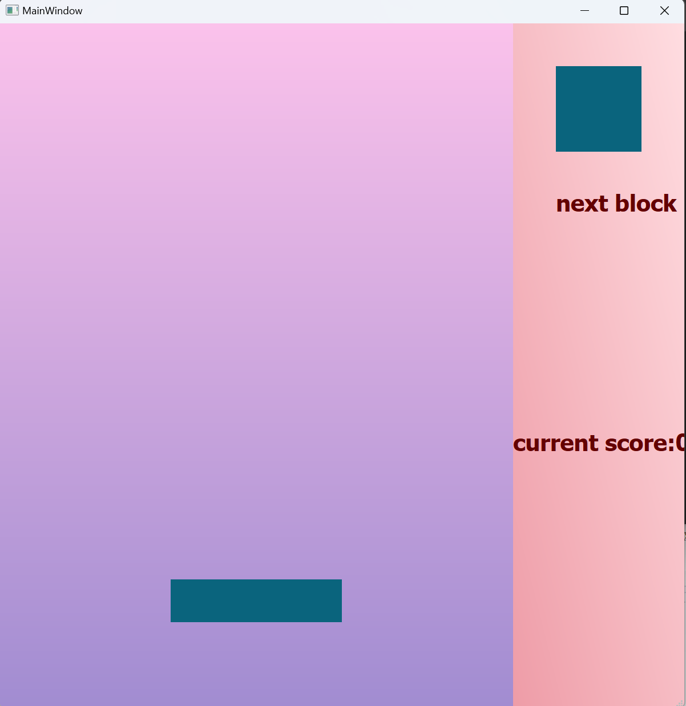
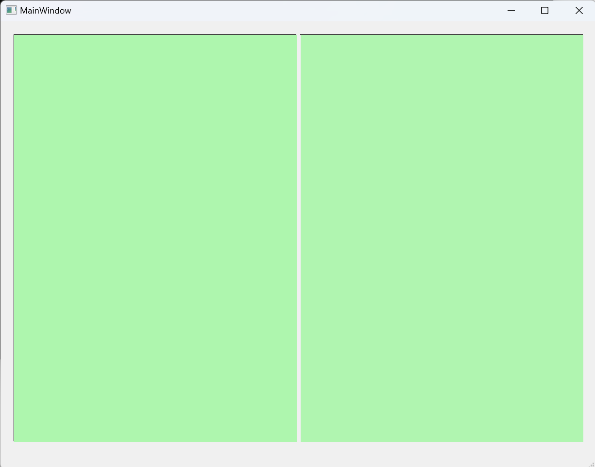
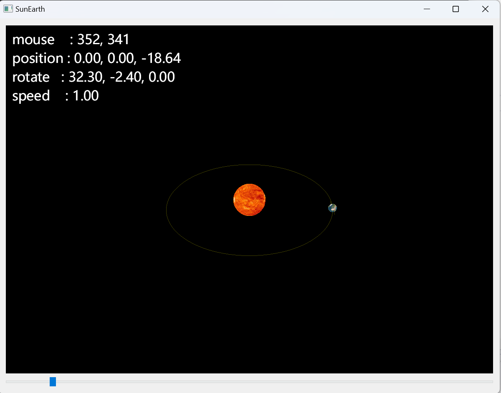
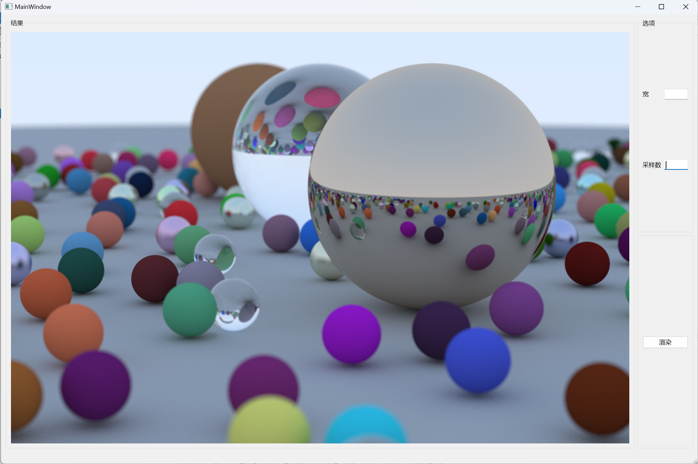
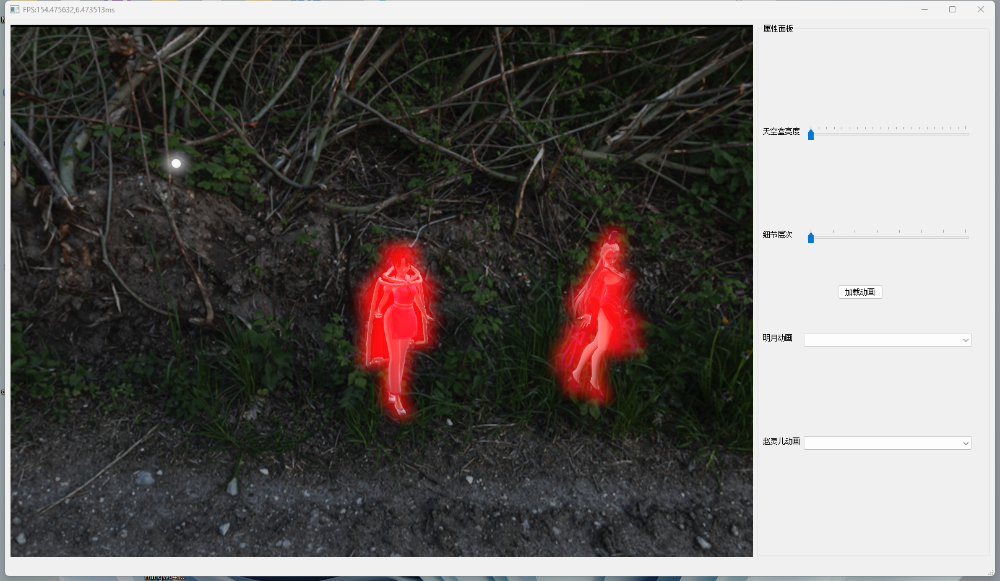
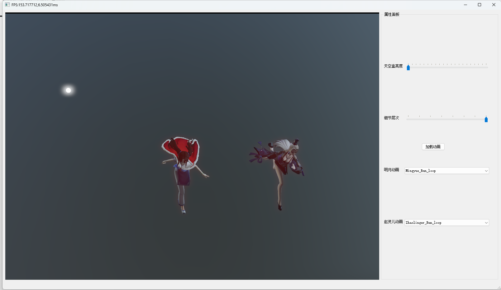

# Use Qt

使用Qt写的几个例子

## Block

使用QPainter, 以及各种鼠标键盘事件，定时器，模拟方块游戏。

## DirectX11Init

在Windows平台下，使用DirectX11来绘制QWidget。

## SunEarth

借助QOpenGLWidget来使用OpenGL，模拟了地球围绕太阳公转。

## RayTrace

## opengl

这是一个尝试在Qt下编写的OpenGL物理渲染器

**实现的功能有：**

- 实现了简单的骨骼动画
- 实现了PBR 和IBL
- 使用计算着色器烘培IBL
- 使用计算着色器实现bloom效果

**程序运行截图**

## 截屏Screen

